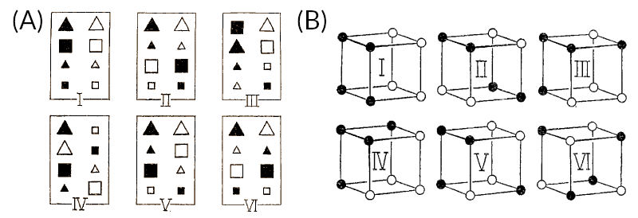

<!--
The following line is required to re-set page numbering after preliminary material. Do not remove
-->
\clearpage\pagenumbering{arabic}\setcounter{page}{1}


# Introduction {#ch:intro}

Even after more than a century of research on the topic of category learning [@Hull1920], little is known about the cognitive processes by which new rules and rule abstractions are learned. One foundational contribution to the research on human concept and category learning is the Six Problems paradigm introduced by @Shepard1961. In their seminal work, participants were presented with a set of eight stimuli that can be seperated into two groups along three binary attributes (shape, size and color) which they had to classify. There were six types of classifications for the sets of stimuli (see fig. \@ref(fig:01-shj)). What the researchers found was a distinct order of difficulty in learning these rules (I < II < III, IV, V < VI), mostly independent of the items to learn, be it simple geometric shapes, musical instruments or everyday kitchen tools. In the following decades this became (and still remains to be) a major benchmark for the predominant category learning models, such as ALCOVE [@Kruschke1992], SUSTAIN [@Love2004] or DIVA [@Kurtz2007], which can all successfully predict the aforementioned difficulty hierarchy. 

However, these mofels all fail at predicting novel or previously unencountered stimuli in one way or another `[proably elaborate?]`, especially when it comes to problem type II, which is otherwise known as "exclusive OR" (XOR) problem^[Since categories can not be seperated by a flat plane in a three-dimensional space with each dimension relating to the three attributes of the stimuli. `[needs better explanation. Or none.]`]. Beyond that, recent research shows a major influence of rule-related language having an effect in a subject's performance on that problem [@Kurtz2013]: the long held learning advantage in solving Type II category structures over Type IV structures disappears when experimental instructions don't use the mentioning of rules. Additionally, the learning curves of the Type II problem is bimodal and the advantage of Type II over Type IV appears to be an aggregate effect of these two subgroups of people [@Kurtz2013]: Some participants perform quite well on the task while others don't, which in turn implies entirely different cognitive processes being at work there.

(ref:01-shj) Exemplary Structure of the Six Problem Types; figure taken from the original paper: "Six different classifications of the same set of eight stimuli. (Within each box the four stimuli on the left belong in one class and the four stimuli on the right in the other class.)" [@Shepard1961].

```{r 01-shj, fig.cap='(ref:01-shj)', out.height="30%", out.width="50%"}

```

Building on that, @CK17 were able to show that indeed there are two rather distinct types of rule or concept learners regarding the Type II or XOR problem. In an experiment adapted from the classical six problems setup, participants learned to classify a reduced set of stimuli with two atrribute dimensions (size and shade) into a XOR structure, but were left with some of those stimuli untrained (see figure \@ref(fig:ch2-stimuli) in the methods section). In a subsequent transfer phase of the experiment (including the full set of stimuli) the researchers found 30% of their participants to categorize the novel stimuli in a way that resolves to a full XOR solution of the task while the majority classifies the novel stimuli to the more proximal categories previously learned in the training phase. While these findings provide meaningful insight into category learning behaviour, they don't explain what actually is going on.

One recent attempt at shedding light on the issue is the Category Abstraction Learning model (CAL) put forth by @Schlegelmilch2021. As stated by them directly, CALs three central assumptions are:

> 1. Category rules emerge from two processes of stimulus generalization (similarity) and its direct inverse (category contrast) on independent dimensions. 
> 2. Two attention mechanisms guide learning by focusing on rules, or on the contexts in which they produce errors. 
> 3. Knowing about these contexts inhibits executing the rule, without correcting it, and consequently leads to applying partial rules in different situations. [@Schlegelmilch2021]

One important and novel process introduced with CAL is called contextual modulation: A cognitive mechanism by which conditional hypotheses are based on (previously learned) simple rules that can be applied depending on contextual stimuli (e.g. another stimulus feature), leading to better or easier classification given a more complex rule. 

Regarding the incomplete-XOR problem in particular, that means instead of memorizing every stimulus and then inferring category membership of novel stimuli by similarity, the problem can be seen as a one-dimensional rule that has to be inverted given a specific context; e.g. "small squares belong to A, except when black" [see @Schlegelmilch2021]. Consequently, @Schlegelmilch2021 suggest that extrapolation to a full-XOR solution in an incomplete-XOR task can be explained with CAL by contextual modulation as a result of conditional hypotheses on simple rules.


## Research Questions

As mentioned before, @Kurtz2013 have shown for the classic Type II problem that instructions mentioning rules facilitate learning of an exclusive-or rule structure. Here, we posit that this effect, according to CAL, should also facilitate extrapolation in an incomplete-xor task. In more detail, according to CAL, rule instructions (compared to neutral instructions) increase the precision/strength with which rules are learned, which predicts quicker XOR learning and more frequent XOR extrapolation in the incomplete XOR transfer task. An analogue effect (quicker learning of simple rules) should be induced if, during learning, a simple rule is established before stimuli are introduced that require rule modulation for correct classification (blocked rule), compared to mixing these stimuli throughout (mixed rule). 

This study aims to replicate the findings of @CK17 as well as provide further insights into the following questions:

- Does learning a simple rule on selected stimuli before encountering stimuli introducing a XOR rule increase XOR-extrapolation for novel stimuli during transfer, compared to mixed training of XOR stimuli (blocked vs. mixed training)?
- Do rule instructions, compared to neutral instructions, induce XOR-extrapolation for novel stimuli during transfer (rule vs. neutral instructions)?
- Do rule instructions, compared to neutral instructions, increase the learning speed in the training phase of the incomplete XOR task (during mixed training of XOR)?


## Hypotheses

These research questions lead to the following set of hypotheses. The first regards XOR extrapolations during a transfer task whereas the second is about the learning speed/success during training.

- **Hypotheses 1**
    - **H1.1** (directed): Higher number of extrapolations in the transfer phase for the stimuli of the untrained/incomplete category in the blocked training condition, compared to the mixed training condition
    - **H1.2** (directed): Higher number of extrapolations for the stimuli of the untrained/incomplete category in the rule instructions condition compared to the neutral instructions condition in the transfer phase
    - **H1.3** (undirected, _exploratory_): Interaction of rule order and the rule instructions on the number of extrapolations within the untrained/incomplete category

- **Hypothesis 2**
    - (directed): quicker learning of categories with rule instructions than without in the mixed rule condition