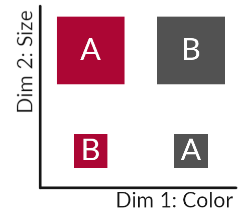

<!--
The following line is required to re-set page numbering after preliminary material. Do not remove
-->
\clearpage\pagenumbering{arabic}\setcounter{page}{1}


# Introduction {#ch:intro}

One major component of everyday human action and cognition is the ability to form concepts, abstract rules and learn all sorts of categories. From stopping at a red traffic light to being able to talk about objects like apples and oranges (so not to confuse them) or abstract concepts like musical genres -- or, in fact, being able to talk to each other in the first place, since language and communication itself follow a whole range of rules and concepts -- category learning is simply a fundamental component of the human experience. Yet even after more than a century of research on the topic [@Hull1920], little is still known about the cognitive processes by which new rules and rule abstractions are learned. There are some predominant theories, however. Prototype models assume that a category has a prototypical example or a central tendency, and that new stimuli are assigned to a category based on similarity to that prototype [see @Posner1968; @Reed1972; @Love2004]. One might infer, for example, a musical act to be a rock band from the fact that some members on stage wear electric guitars. Another account is that of exemplar models, which posit that memory instances of observations made by a learner make up a category [@Kruschke1992; @Nosofsky1986]. Then there is decision bound theory, which employs an abstract psychological space in which a stimulus might be perceived and that is bounded by a decision criterion, e.g. a rule, that is responsible for classifying a stimulus [@Ashby1988; @Reed1972; @Erickson1998]. Also hybrid accounts exist, that propose a prototypical reference point around which memory instances of category exemplars are clustered [@Love2004].

## Theoretical Background

One foundational contribution to the research on human concept and category learning is the Six Problems paradigm introduced by @Shepard1961. In their seminal work, participants were presented with a set of eight stimuli that can be seperated into two groups along three binary dimensions (shape, size and color) which they had to classify into two groups. There were six types of classifications for the sets of stimuli (hence the name), figure \@ref(fig:01-shj) shows these in detail. The researchers found a distinct order of difficulty in learning these rules (I < II < III, IV, V < VI). This order is also mostly independent of the items to learn, be it simple geometric shapes, musical instruments or everyday kitchen tools [@Shepard1961; replicated and extended by @Nosofsky1994; also @Smith2004]. This hierarchical order coincides with the circumstance that for successful classification in the Type I problem, one needs to consider only one of the dimensions (e.g. color for Type I in fig. \@ref(fig:01-shj)), two dimensions in problem Type II (color and shape for in fig. \@ref(fig:01-shj)) and all three stimulus dimensions for other types. In the following decades this paradigm became and still remains to be a major benchmark for category learning models and spurred ideas about how feature attention may play a major role in the category learning process [@Nosofsky1986]. One leading formal framework resulting from this insight is ALCOVE -- the Attention Learning COVEring map [@Kruschke1992], which uses an attention mechanism to focus on a predictive stimulus dimension and to switch that focus to a different dimension when errors are made. By combining this (selective) attention mechanism with the stimulus generalization from memory assumed by exemplar theory, ALCOVE has been able to very successfully mirror human behavior in category learning -- not only in the six problem task, but other well established tasks like the 5-4 problem [@Medin1978] or the inverse base-rate effect [@Kruschke1992; @Kruschke2001; @Kruschke2003].


(ref:01-shj) Exemplary Structure of the Six Problem Types; figures taken from the original paper [@Shepard1961]; (A) "Six different classifications of the same set of eight stimuli. (Within each box the four stimuli on the left belong in one class and the four stimuli on the right in the other class.)" (ibid.) (B) The same classification structure, each axis representing a stimulus dimension and black/white circles depicting class membership.

```{r 01-shj, fig.cap='(ref:01-shj)', out.height="25%", out.width="100%"}
knitr::include_graphics("figures/six-problems.png")
```

Recent research, however, raises some serious questions on the role of stimulus generalisation. In a widely recognized study, @Kurtz2013 identified a major influence of rule-related language on a subject's performance in the classic setup of @Shepard1961: the long held learning advantage in solving Type II category structures over Types III-V disappears when experimental instructions don't use the mentioning of rules. Additionally, there appear to be two groups of participants: Some achieve higher accuracies in the Type II than in the Type IV problem, while others solve Type II worse than Type IV. The researchers also note that, in line with the original work of @Kruschke1992, ALCOVE can predict a similar pattern for Type II as observed by [@Kurtz2013] when attention learning is "turned off" (ibid., p.564). However, it cannot do so while keeping its accurate predictions for Type I and IV at the same time. These results imply entirely different cognitive processes being involved. Importantly, as being able to predict a Type II advantage is a major benchmark for many formal models to pass, these results challenge the common conviction of stimulus generalization driven by dimensional selective attention (ibid.).

(ref:01-xor) Example of a simple XOR structure.

```{r 01-xor, fig.cap='(ref:01-xor)', out.height="31%", out.width="50%"}

```

One reason why the assumed learning advantage in the Type II problem is so remarkable is, because it's a so called XOR problem. XOR stands for "exclusive or", coloquially meaning "either one or the other (but not both)", or in more formal terms, a logical operation (like category classification) that is true ("stimulus belongs to category A") if and only if its inputs (the value of stimulus dimensions) differ. Figure \@ref(fig:01-xor) gives an example: a stimulus belongs to category A if it is "big and red" (X)OR "small and grey".^[Another way to think about it is to imagine a straight line and trying to bring both stimuli labeled A to one side of the line and those labeled B to the other (without moving the squares!), which of course is impossible.] In an experiment building on that fact, @CK17 were able to show that there are indeed two rather distinct types of rule or concept learners when it comes to the Type II or XOR problem and point out possible shortcomings of models using reference points to generalize stimuli by similarity. In their experiment they used an adapted version of the classical six problems setup. In a (supervised) training phase, participants learned to classify a reduced set of stimuli with two attribute dimensions (size and shade) into a XOR structure. Reduced means, participants didn't encounter stimuli from one quadrant of the full set of stimuli (see figure \@ref(fig:ch2-stimuli) in the methods section). In a subsequent transfer phase they then had to classify the complete set, including the previously untrained stimuli. The researchers found 30% of their participants (and 45% in a second experiment) to categorize the novel stimuli in a way that resolves to a full XOR solution while the majority classifies the novel stimuli to the more proximal categories previously learned in the training phase [@CK17]. With regard to exemplar models this means that even though the incomplete/untrained stimuli are the exact opposite of their learned counterparts and in terms of similarity as far away from each other as possible, there were still a substantial number of people who learned the corresponding XOR rule. 

One recent attempt at providing an explanation of the process of XOR-extrapolation is the Category Abstraction Learning model (CAL) put forth by @Schlegelmilch2021. As stated by them directly, CALs three central assumptions are:

> 1. Category rules emerge from two processes of stimulus generalization (similarity) and its direct inverse (category contrast) on independent dimensions. 
> 2. Two attention mechanisms guide learning by focusing on rules, or on the contexts in which they produce errors. 
> 3. Knowing about these contexts inhibits executing the rule, without correcting it, and consequently leads to applying partial rules in different situations. [@Schlegelmilch2021]

One important process put forth with CAL is called contextual modulation: A cognitive mechanism by which conditional hypotheses are based on previously learned simple rules that can be applied depending on contextual stimuli (e.g. another stimulus feature). This leads to better or easier classification given a more complex rule. Regarding the incomplete-XOR problem in particular, that means instead of just memorizing every stimulus and then inferring category membership of novel stimuli by similarity, the problem can be seen as simple one-dimensional rule that has to be inverted given a specific context; e.g. "red squares belong to A, except when small" [see @Schlegelmilch2021]. From this point of view, the results of @CK17 can be explained by assuming that those participants who inferred a full XOR solution did so by contextual modulation. Consequently, @Schlegelmilch2021 suggest that extrapolation to a full-XOR solution in an incomplete-XOR task can be explained with CAL by contextual modulation as a result of conditional hypotheses on a simple rule. In other words, the contrasting of a rule. In CAL, the contrasting of rules is formally decribed by its free $\gamma$ parameter, while contextual modulation is decribed by $\omega$. Decreasing the value of $\gamma$ leads to stronger contrasting of rules, which in turn should trigger the contextual modulation of stimuli. Larger values, on the other hand, lead to stronger generalization of category membership [see @Schlegelmilch2021]. In principle this means that by contrasting just a single trial does suffice to derive that "grey" is B from only seeing that "A" is red. However, @Schlegelmilch2021 do point out that in order to trigger the contextual modulation of stimuli, a simple rule to contrast against has to be well established (ibid.). Additionally, this $\gamma$ parameter is assumed to vary on an individual level, which might explain why some participants reach a full XOR solution and others don't. In fact, simulations have already shown that CAL is able to predict such a pattern while simultaneously fitting very well to human results from the six problems, amongst other benchmarks (ibid.). 


## Research Questions

From the theoretical considerations laid out above results the question of how well the assumptions of the CAL framework predict human extrapolation behaviour in an incomplete-XOR task.

@Kurtz2013 have shown for the classic Type II problem that instructions mentioning rules facilitate learning of an exclusive-or rule structure and @CK17 presented a method to investigate such an extrapolation behaviour in a way independent from established accounts of exemplar models generalizing from instance memory. This study puts forth that such an effect, according to the CAL framework, should also facilitate extrapolation in an incomplete-XOR task [see @Schlegelmilch2021]. Also, rule instructions (compared to neutral instructions) should increase the saliency of contextual modulation and thereby increase the strength by which rules are learned. This in turn predicts quicker XOR learning and more frequent XOR extrapolation in the incomplete-XOR transfer task. An analoguous effect should be induced if, during learning, a simple rule is established by a blocked ruled condition before stimuli are introduced that require rule modulation for correct classification, compared to mixing these stimuli throughout in a mixed rule condition.

This study aims to replicate the findings of @CK17 as well as provide further insights into the following questions: Does learning a simple rule on selected stimuli before encountering stimuli introducing a XOR rule increase XOR-extrapolation for novel stimuli in a transfer task, compared to mixed learning of XOR stimuli (blocked vs. mixed training)? Do rule instructions induce XOR-extrapolation for novel stimuli in such a transfer task compared to neutral instructions (rule vs. neutral instructions)? Do rule instructions, compared to neutral instructions, increase the learning speed in the training phase of the incomplete-XOR task (during mixed training of XOR)?


## Hypotheses {#01-hypotheses}

These research questions lead to the following set of hypotheses. H1.1 through H1.3 regard XOR extrapolations during a transfer task, whereas H2 is about the learning speed/success during training.

**Hypotheses 1**  
**H1.1** (directed) -- Higher number of extrapolations in the transfer phase for the stimuli of the untrained/incomplete category in the blocked training condition, compared to the mixed training condition  
**H1.2** (directed) -- Higher number of extrapolations for the stimuli of the untrained/incomplete category in the rule instructions condition compared to the neutral instructions condition in the transfer phase  
**H1.3** (undirected, _exploratory_) -- Interaction of rule order and the rule instructions on the number of extrapolations within the untrained/incomplete category

**Hypothesis 2** (directed) -- Quicker learning of categories with rule instructions than without in the mixed rule condition

<!-- **Exploration**: Additionally we will look at how certain people are in their categorical decisions, asking them -->