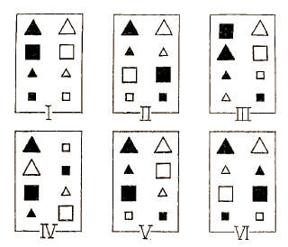

<!--
The following line is required to re-set page numbering after preliminary material. Do not remove
-->
\clearpage\pagenumbering{arabic}\setcounter{page}{1}


# Introduction {#ch:intro}

Even after more than a century of research on the topic of category learning [@Hull1920] little is known about the cognitive processes by which new rules and rule abstractions are learned. One recent attempt at shedding light on the issue is the CAL model (Category Abstraction Learning) by @Schlegelmilch2021. The key assumptions of how new rules are learned by CAL are (threefold)


The gold standard in the research of human concept and category learning are the six problem types introduced by @Shepard1961. In their seminal work they were able to show a set of foundational rules and category structures (see fig. \@ref(fig:01-shj)) which are increasingly difficult to learn by human subjects - mostly independent of the items to learn, be it simple eometric shapes, musical instruments or everyday kitchen tools.   

<!-- ![Exemplary Structure of the Six SHJ Problem Types; figure taken from the original paper: "Six different classifications of the same set of eight stimuli. (Within each box the four stimuli on the left belong in one class and the four stimuli on the right in the other class.)" [@Shepard1961]](figures/six_problems.png) -->

(ref:01-shj) Exemplary Structure of the Six SHJ Problem Types; figure taken from the original paper: "Six different classifications of the same set of eight stimuli. (Within each box the four stimuli on the left belong in one class and the four stimuli on the right in the other class.)" [@Shepard1961].

```{r 01-shj, fig.cap='(ref:01-shj)', out.height="20%", out.width="40%"}

```

In the following years and decades, one major consistent finding was a learning advantage in human subjects of the Type II category structure over the Type IV one. This in turn, however, proved to be a major problem in cogntive models trying to explain this learning process. 

More recent researched based on their seminal work showed a major influence of rule-related language having an effect in subject's performance on those problems [@Kurtz2013]: the long held learning advantage in solving Type II category structures over Type IV structures disappears when experimental instructions don't use the mentioning of rules.

Furthermore, @CK17 were able to show in a novel experimental adaptation to the classic SHJ-setup that there appear to be (at least) two rather distinct types of rule or concept learners: people who categorize novel stimuli in a way that resolves to a full XOR solution (equivalent to the Type II problem in SHJ) and those who classify the novel stimuli to the more proximal categories previously learned in a training phase.
Finally, @Schlegelmilch2021 proposed that extrapolating XOR category structures can be explained by contextual modulation; a cognitive mechanism by which conditional hypotheses are based on (previously learned) simple rules that can be applied depending of contextual stimuli (e.g., another stimulus feature), leading to better or easier classification given a more complex rule. Consequently, with their Category Abstraction Learning model (CAL) they suggest that extrapolation to a full-XOR solution in an incomplete-XOR task is a result of conditional hypotheses of simple rules.

According to the findings of @Kurtz2013, instructions mentioning rules facilitate learning of an exclusive-or rule structure, which they have shown for the classic Type II problem. Here, we posit that this effect, according to CAL, should also facilitate extrapolation in an incomplete-xor task. In more detail, according to CAL, rule instructions (compared to neutral instructions) increase the precision/strength with which rules are learned, which predicts quicker XOR learning and more frequent XOR extrapolation in the incomplete XOR transfer task. An analogue effect (quicker learning of simple rules) should be induced if, during learning, a simple rule is established before stimuli are introduced that require rule modulation for correct classification (blocked rule), compared to mixing these stimuli throughout (mixed rule). 

## Hypotheses

These research questions lead to the following set of hypotheses. The first regards XOR extrapolations during a transfer task whereas the second is about the learning success during training.

- **Hypotheses 1**
    - **H1.1** (directed): Higher number of extrapolations in the transfer phase for the stimuli of the untrained/incomplete category in the blocked training condition, compared to the mixed training condition
    - **H1.2** (directed): Higher number of extrapolations for the stimuli of the untrained/incomplete category in the rule instructions condition compared to the neutral instructions condition in the transfer phase
    - **H1.3** (undirected, _exploratory_): Interaction of rule order and the rule instructions on the number of extrapolations within the untrained/incomplete category

- **Hypothesis 2**
    - **H2.1** (directed): quicker learning of categories with rule instructions than without in the mixed rule condition
    - **H2.2** (undirected, _exploratory_): Interaction of learning accuracy between training blocks (3-12) and rule instructions in the blocked rule condition