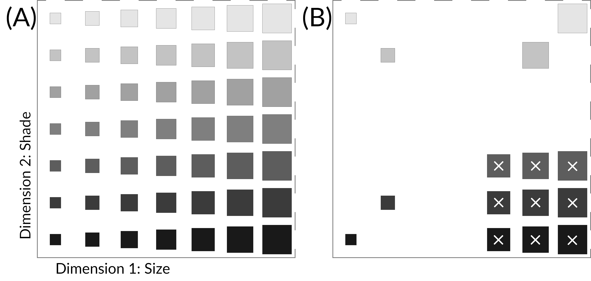
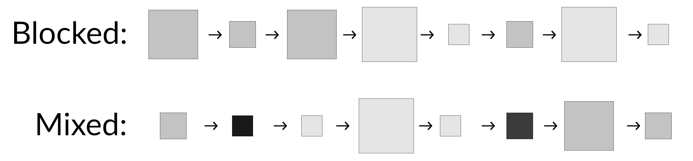

```{r demo_data}
dur <- quantile(demo$duration, c(.025, .95)) |> as.numeric()
exc_id <- unique(exclud_trans$subj_id)
```

# Methods {#ch:methods}

An online experiment has been conducted using the \_magpie 3 framework (https://magpie-ea.github.io/magpie-site/). This chapter describes the collected sample, the experimental setup and procedure, the data preparation and the statistical methods to be used for data analysis. The experiment has been pre-registered according to the guidelines of the Open Science Foundation (https://osf.io/)^[Link to the pre-registration: [https://osf.io/wegm9](https://osf.io/wegm9)]. All code regarding the experiment and the data analysis can be found on the corresponding project page^[Link to the project: [https://osf.io/gup7x/](https://osf.io/gup7x/)].

## Data collection procedure and sample description

For data collection, the mailing lists of the psychology and cognitive science courses of the University of Osnabrück, as well as the psychology mailing list of the University of Bremen have been used, additional to several social media channels like facebook groups for psychology students and verbal recruitment. Participation was completely anonymous, voluntary and could be withdrawn at any time before submitting results. Students of said courses had the opportunity to receive 0.5 participation hours as compensation^[In order to keep the experimental data anonymous, the necessary personal data needed to hand out VP-hours was collected in a seperate dataset which could not be traced back to the experimental dataset. For the same reason, participation could not be revoked after data has been submitted.] and participants were required to be at least 18 years old and native german speakers. 

A total of `r nrow(demo) + length(exc_id)` participants took part in the experiment, of which `r nrow(demo)` are eligible after exclusion. Average age of participants is `r mean(demo$age, na.rm = TRUE) |> round(1)` years (_min_ = `r min(demo$age, na.rm = TRUE)`, _max_ = `r max(demo$age, na.rm = TRUE)`, _SD_ = `r sd(demo$age, na.rm = TRUE) |> round(2)`) and median duration of participation is `r median(demo$duration, na.rm = TRUE) |> round()` seconds. There are `r demo %>% filter(duration > dur[2]) %>% nrow()` participants whose participation took more than 30 minutes (>95% quantile); without these, standard deviation is `r demo %>% filter(duration < dur[2]) %>% pull(duration) %>% sd() |> round()` seconds.


## Experimental setup & procedure

The basic experimental setup is an iteration of the incomplete-XOR task by @CK17, using the same set of stimuli (see figure \@ref(fig:ch2-stimuli)) and consisting of a training and a transfer phase. In the training phase of the experiment, participants are shown 6 squares of differing shade and size in a trial-and-feedback procedure. Upon presentation, they have to predict whether the given stimulus belongs to fictionally labeled categories "Nobz" or "Grot". After making their choice, participants will receive feedback on whether they were correct. The stimuli of the incomplete category get displayed twice per block to "equate for category frequency" [@CK17], resulting in 8 trials per block across all conditions; that is, all stimuli in the first 2 blocks / 16 trials of the blocked condition will also be shown twice per block. The training phase consists of 12 randomized blocks and therefore 96 trials in total.

(ref:ch2-stimuli) (A) Full set of stimuli to be used during the transfer phases, taken from @CK17. During the experiment, only one square was shown at a time. (B) Subset of stimuli used during training and unobserved subset of interest for extrapolation (marked X).

```{r ch2-stimuli, fig.show="hold", out.height="33%", out.width="100%", fig.cap="(ref:ch2-stimuli)"}
# knitr::include_graphics(c("figures/all-stimuli-arranged.png", 
#                           "figures/stimuli-trainfer.png"))

```

In a subsequent transfer phase, the full set of 49 stimuli has to be classified without feedback, but otherwise remains the same. After that, the transfer phase will be repeated, the second time though participants are instructed to make a probability judgement about the stimulus category membership (e.g. 30% Nobz, 70% Grot) via a slider rating ranging from 0 to 100 in steps by 1.

At the end of the experiment, pariticipants are asked to fill out basic demographic information as well as to answer a question about their strategy during transfer. A last question asks participants whether they have any reason to believe their data should not be used, like distractions, noise, inattentivenes or the like. All answers to these questions are voluntarily given and can be left blank. 

### Experimental manipulation {#ch2-setup}

In addition to the basic setup of @CK17 there are four different experimental groups: The first group serves as control group that receivs no experimental treatment, meaning they aren't told to look for rules and encounter all training stimuli intermixed right from the beginning. To address hypothesis 1.1, the "Blocked Rules" group sequentially learns two rules: in the first two training blocks they learn to classify stimuli along one dimension only, e.g. they only encounter large squares after training block two (see figure \@ref(fig:ch2-blocked)). For Hypothesis 1.2 a "Rule Instrucions" group encounters all training stimuli from the beginning but is explicitly told twice in their instructions to the task to look for a rule to classify the stimuli by; this group's learning phase can also be contrasted against the first in order to approach hyppthesis 2. A fourth "Blocked + Instructions" group then is subject to both manipulations by which a possible (additive) interaction can be investigated with regad to hypothesis 1.3. 

This setup results in a two-factorial between subjects design with two levels each: instructions (rule vs. neutral) and training order (blocked vs. mixed). The differences of which deserve a closer look. The important bit of the instructions **without mentioning rules:** reads: "[You'll be shown] geometric shapes that differ in color and size. Your task is to learn, whether a figure belongs to category **Nobz** or category **Grot** [...] Do your best to master the categories Nobz and Grot!" The ones that **do mention rules** on the other hand read: "Your task is to learn a rule on the basis of color and size by which you can decide whether a figure belongs to category **Nobz** or category **Grot** [...] Do your best to master the rule for categories Nobz and Grot!"^[although the study was conducted in German, the translation is rather direct; see Appendix x for the original and full instructions.] As mentioned before, within the training oder the **blocked** rule means that stimuli in the first two blocks of training (16 trials) correctly classifed entirely bei either their shape or their size and only afterwards the task becomes more complicated by showing the two additional stimuli from the whle training set (see fig. \@ref(fig:ch2-stimuli) for clarification). The **mixed** rule simply shows all training trials (and thereby the whole category structure) at random from the beginning.

(ref:ch2-blocked) Example of a blocked and a mixed training block. While the mixed set contains all available training stimuli, the blocked one contains only ones that can be classified along one dimension (size in this case).

```{r ch2-blocked, fig.show="hold", out.height="20%", out.width="100%", fig.cap="(ref:ch2-blocked)"}
# knitr::include_graphics(c("figures/all-stimuli-arranged.png", 
#                           "figures/stimuli-trainfer.png"))

```

### Randomization

Participants are randomly assigned to experimental groups by _magpie3's balanced randomization functionality upon opening the link to the experiment. For the training phase, the assignment of categories (which set of stimuli corresponds to Nobz and which to Grot) is randomized as well as the dimension (size / shade) by which the stimuli of the blocked rule condition can be classified by. Trial randomization happens on a by-block level. For the transfer phases, the full set of stimuli is randomized blockwise as a whole. 


## Data preparation & exclusion

A sample size of 40 complete and eligible observations (after exclusion) per experimental group was preregistered, resulting in a total of 160 participations required. A naive power calculation (or estimation, rather) for a simple logistic regression assuming an odds ratio of 2, requires 34 people per group to reach a power of 80%^[Since the analysis is rather complex in addition to being conducted with bayesian modeling, a full power analysis in the classical sense was deemed beyond the scope of this thesis.]. @Chen2010 show that this assumption translates to a rather small effect, with an OR of 1.68 being equivalent to a Cohen‘s d of 0.2. Simulations by @Chen2017 show similar results and @Brysbaert2018 also recommend a sample size of about 40 people (with equally as many stimuli), albeit on a more general basis. 

### Data exclusion 

Participants that appear to be guessing in the training phase (the probability of correct classification on a single trial being 0.5) are excluded. The above-chance number of correct classifications needed (based on a 5% alpha level) in the last 3 training blocks (24 trials) then is 16. Additionally, any participant answering the question about any reason to not use their data in the affirmative is excluded as well - although in practice no one did that.

While two people haven been identified by the criterion above, after data collection and upon closer inspection, three additional participants have been identified that clearly didn't learn the category strucure. Two participants classified stimuli solely along one stimulus dimension only (ignoring the second), which can lead to 18 correctly classified stimuli and 6 errors, thereby passing the threshold. One participant barely passed but didn't give sensible responses in the transfer phase. Figure \@ref(fig:ch2-plot-exclusions) shows the accuracy of the last three training blocks and the responses in the transfer phase of the excluded individuals.

(ref:ch2-plot-exclusions) Response accuracy for excluded participants on the last 3 blocks of training and respective responses of the transfer phase. Each square maps 1:1 to the stimulus positions as shown in \@ref(fig:ch2-stimuli).

```{r ch2-plot-exclusions, fig.cap="(ref:ch2-plot-exclusions)", fig.height=2.2}
plex_train <- exclud_train %>% 
  left_join(distinct(select(exclud_trans, image, img_x, img_y)), by = "image") %>% 
  filter(block > 9) %>% 
  group_by(subj_id, img_x, img_y) %>% 
  summarise(
    p_correct = round(mean(correct) * 100, 1),
    img_x = ifelse(img_x > 2, img_x - 2, img_x),
    img_y = ifelse(img_y > 2, img_y - 2, img_y),
    .groups = "drop"
  ) %>%
  ggplot(aes(img_x, img_y, fill = p_correct)) +
    facet_wrap(~subj_id, nrow = 1) +
    geom_tile(size = .5) +
    scale_fill_viridis_c(
      guide = guide_colorbar(
        barwidth = 1,
        barheight = 3
      )
    ) +
    labs(fill = "Acc.") +
    theme_subjects +
    theme(panel.border = element_rect(color = "#3c3c3c", fill = NA),
          legend.text  = element_text(size = 6),
          legend.position = "right",
          legend.justification = c(.9, .1))

plex_trans <- ggplot(exclud_trans, aes(img_x, img_y, fill = response)) +
  facet_wrap(~subj_id, nrow = 1) +
  geom_tile(size = .5, color = "white") +
  scale_fill_manual(values = c("#ac0634", "#525252")) +
  theme_subjects +
  theme(panel.border = element_rect(color = "#525252", fill = NA),
        legend.text  = element_text(size = 6),
        legend.position = "none")

plex_train / plex_trans
```


## Analysis plan

All analyses are conducted using R (@R4, v`r paste0(R.Version()$major, ".", R.Version()$minor, " - ", R.Version()$nickname)`). For a full list of all additionally used packages see Appendix X. As already mentioned, all raw and prepared data as well as the corresponding analysis scripts are available via the osf repository^[Again, the link to the project for convenience: [https://osf.io/gup7x/](https://osf.io/gup7x/)]. 

To investigate the hypotheses laid out in the previous chapter, several bayesian mixed-effect logistic regression models using logit-links are computed with rather weakly informative priors. @Gelman2020 recommends using $\operatorname{student}(df, mean = 0, sd = 1)$ where $3 \leq df \leq 7$, since the often used Cauchy-Distribution (that is, $\operatorname{student}(1, 0, 2.5)$) has too thick tails and a strict Gaussian might be too informative in the case at hand. Finally, Bayes Factors for model comparisons are obtained by computing marginal likelihooods via bridge sampling [@Gronau2020]. Since that method requries a rather high amount of posterior samples to obtain robust bayes factors, each model will have 4 MCMC chains with 12000 samples and 2000 warm-up samples each, resulting in 40000 posterior samples drawn per model [for details, see @Schad2021]. Convergence and stability of the Bayesian sampling has been assessed using R-hat, which should be below 1.01 [@Vehtari2021], and Effective Sample Size (ESS), which should be greater than 1000 [@Buerkner2017].

### Model comparisons in detail

**Effects on extrapolations --** For hypotheses 1, only the trials of the nine critical items of the incomplete category of the transfer are used (marked X in fig. \@ref(fig:ch2-stimuli)) for analysis. Both H1.1 and H1.2 assume one main effect each, namely one of rule instructions and one of blocked training; H1.3 assumes an interaction effect of both. Therefore, we fitted five models: (1) a full model containing all effects and their interaction, (2) a reduced model with both main effects but no interaction term, (3) a reduced model including just the effect of instructions, (4) one including just the blocked rule effect and finally (5) a reduced model that included no effects at all; also, all models except (1) don't include an interaction term. The computation of bayes factors can be approached by two ways, either additively or subtractively. An additive approach means to sequentially add effects to a model and comparing it to the one without. A substractive approach takes the other direction and sequentially removes effects, comparing the smaller to the larger. Since in this case only two main effects are considered, both approaches are equal. Bayes factors are therefore computed for each model compared to the fifth, such that the results can, for example, be read as "extrapolations are x times more/less likely to occur when exposed to a blocked training condition than when not".

**Effect on Learning --** In similar fashion, hypothesis 2 is tested on a subset of data including only the groups receiving rule instructions and no treatment. In this case, there are only two models: one that includes the main effect of rule instructions and one that includes no effect, which again are compared via bayes factor.

All model specifications are outlined in detail in their respective results section.

### Inference criteria {#02-ic}

Hypotheses are evaluated with Bayes Factors according to @Andras2014^[adjusted from Jeffreys, 1961]: $BF_{12} > 3$ constitutes moderate evidence for $M_1$ over $M_2$ (or vice versa when $BF_{12} < 1/3$) and $BF_{12} > 10$ (or $BF_{12} < 1/10$) will be interpreted as strong evidence respectively. Bayes Factors between 1/3 and 3 are treated as no meaningful evidence in favor of either model.

### Exploration

The second transfer phase in which participants are asked about their probability judgement for any given stimulus belonging to either category is not linked to a specific hypothesis. 